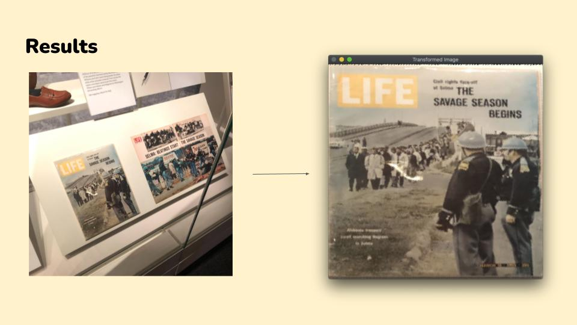

# Perspective Transform
Authors: John Trager and Daniel Stefenascu

Presentation Slides (click image to open slides):<br>
[](https://github.com/John-Trager/Homography-Transform/blob/526ead628c0498f8032dc31a86c35d5277d460a7/media/214%20Final%20presentation.pdf)

## Results





## How to Use
Make sure that your python env has the correct deps (as specified in requirements.txt)

To run the homography transform use the file `run.py`<br>
```
python3 run.py -i <image path> --points_in <image points on input plane> --points_out <image points on output plane> -c <compression number>
```

Run on example:
```
python3 run.py -i test_data/tv.jpg --points_in "[[280,120],[504,295],[450,534],[184,560]]" --points_out "[[0,0],[0,200],[200,200],[200,0]" -c 4
```

Argument descriptions:<br>
```
-h, --help            show this help message and exit
-i IMG, --img IMG   <Required> path to image to be transformed
--points_in POINTS_IN
                    <Required> 4 points 1st img plane, points should be clockwise ordered "[[x1,y1],[x2,y2],...]"
--points_out POINTS_OUT
                    <Required> 4 points for 2nd img plane, points should be clockwise ordered "[[x1,y1],[x2,y2],...]"
-c COMPRESSION, --compression COMPRESSION
                    <Optional> scale/compression number
```

The `points_in` flag takes in point pairs [x,y]. These points must be in clockwise order starting from the top left point, likewise for the points_out flag.
